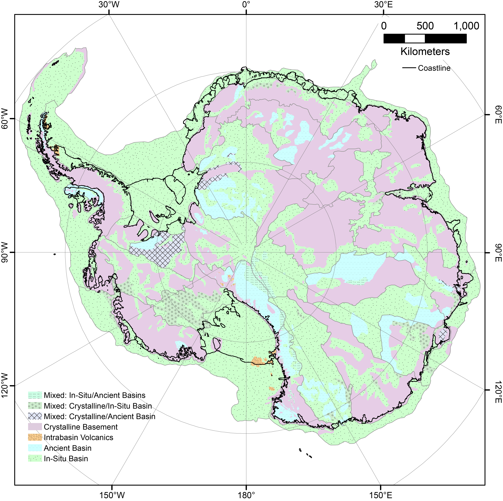

# GIS Package for Antarcitca's Sedimentary Basins

**AntBasins** is an open repository for hosting the Antarctica's Sedimentary Basins GIS package. It includes the sedimentary basin distribution, sedimentary basin type, and sedimentary basin age. The goal of this project is to build a community-derived knowledge of Antarctica's Sedimentary Basins. 

[👉View Map](https://geojson.io/#id=github:LL-Geo/AntarcticBasins/blob/main/DistroPackage/AntarcticBasins_v1.04.geojson&map=2.72/-85.05/-6.33)

## Contributing to Sedimentary Basins Mapping
Understanding of Antarctica's Sedimentary Basins will likely change with the increase of data coverage and resolution. Therefore, we aim to use community effort to keep updating the GIS package.

📝 Please make edit to the GIS package and make a [Pull Requets](https://github.com/LL-Geo/AntarcticBasins/pulls)
to submit your data.

Please read our
[Contributing Guide](https://github.com/fatiando/harmonica/blob/main/CONTRIBUTING.md)
to see how you can help and give feedback.

## Project status

The current version of AntarcticBasins is **v1.04**

The version **v1.04** supplyment to the following publication:

Aitken, A. R., Li, L., Kulessa, B., Schroeder, D. M., Jordan, T. A., Whittaker, J. M., ... & Siegert, M. J. (2023). Antarctica's sedimentary basins and their influence on ice sheet dynamics. Review of Geophysics 
